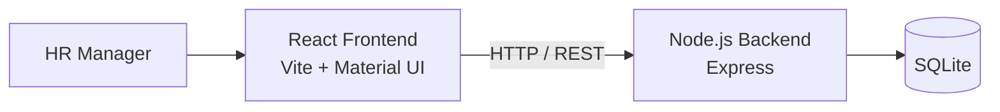
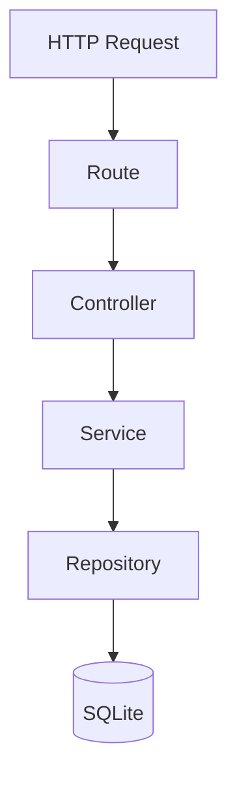
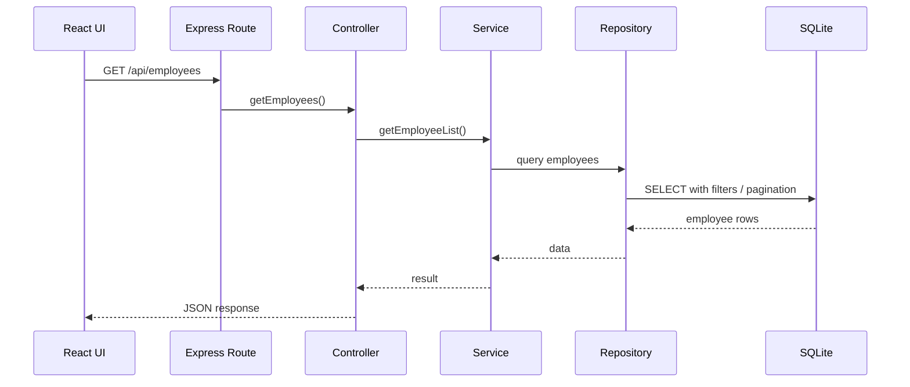
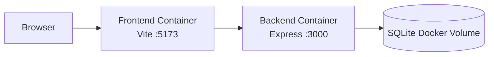

# Architecture

## 1. Overview

The Salary Management System is a web application for HR managers to manage and analyze salary information for approximately 10,000 employees.

The application is split into three main layers:

- React frontend
- Node.js / Express backend
- SQLite relational database

The application is containerized using Docker Compose.

---

## 2. High-Level Architecture



The browser communicates only with the backend API.

The backend is responsible for:

- validation
- business logic
- pagination
- filtering
- sorting
- analytics
- database access

The frontend is responsible for:

- user interaction
- presentation
- loading and error states
- navigation
- calling backend APIs

---

## 3. Backend Architecture

The backend uses a layered architecture:



### Routes

Routes define API endpoints and connect them to controllers.

Example:

```text
GET /api/employees
```

is handled through:

```text
employee.routes.js
```

### Controllers

Controllers deal with HTTP concerns such as:

- request parameters
- request body
- response status
- response JSON

Controllers do not contain SQL.

### Services

Services contain application-level logic and coordinate repositories.

This keeps HTTP-specific code separate from business logic.

### Repositories

Repositories contain database queries.

Only the repository layer directly communicates with SQLite.

This keeps SQL isolated from controllers and routes.

### Validators

Validation is handled before invalid employee data reaches the database.

Examples include:

- required fields
- valid email format
- non-negative salary
- three-letter currency code
- valid joining date
- pagination constraints
- sorting whitelist

---

## 4. Frontend Architecture

The frontend is built with React and organized by responsibility.

```text
src/
├── components/
├── pages/
├── services/
├── test/
├── App.jsx
├── main.jsx
└── theme.js
```

### Pages

Pages represent route-level screens.

Examples:

```text
DashboardPage
EmployeesPage
EmployeeDetailsPage
AddEmployeePage
EditEmployeePage
```

### Components

Reusable UI is placed in components.

Example:

```text
EmployeeForm
```

The same form component is shared between employee creation and editing.

### Services

Frontend API calls are separated from React pages.

For example:

```text
employeeService.js
analyticsService.js
```

This prevents API request logic from being duplicated across components.

---

## 5. Employee Request Flow

Example request:

```text
GET /api/employees?page=2&limit=20&department=Engineering
```

Flow:



---

## 6. Server-Side Pagination, Filtering and Sorting

Employee data is processed by the backend rather than downloading all 10,000 employees into the browser.

The API supports:

- pagination
- text search
- department filtering
- country filtering
- sorting

Example:

```text
GET /api/employees
    ?page=1
    &limit=20
    &search=Rahul
    &department=Engineering
    &country=India
    &sortBy=annualSalary
    &sortOrder=desc
```

This keeps the browser payload small and ensures sorting is applied to the complete matching dataset rather than only the currently visible page.

Sorting fields are whitelisted before being mapped to SQL columns.

---

## 7. Salary Analytics

The application provides salary analytics by:

- currency
- department
- country

A deliberate decision was made not to calculate a single organization-wide payroll total or average across different currencies.

For example:

```text
INR 1,500,000
USD   100,000
GBP    70,000
```

cannot meaningfully be summed without an agreed exchange-rate strategy.

Therefore analytics remain separated by currency until a reporting currency and exchange-rate policy are defined.

---

## 8. Database

SQLite was selected because:

- the dataset is approximately 10,000 employees
- the assessment calls for a relational database
- deployment and local setup remain simple
- the application currently has a single primary HR use case

The main table is:

```text
employees
```

Important constraints include:

- unique employee ID
- unique email
- non-negative annual salary

The seed script generates 10,000 deterministic employee records for development and demonstration.

---

## 9. Error Handling

The backend uses centralized Express error handling.

Examples:

```text
400 → invalid request
404 → employee or route not found
409 → duplicate employee ID or email
500 → unexpected server error
```

The frontend converts API errors into user-visible error states using Material UI alerts.

---

## 10. Testing Strategy

The project contains multiple types of automated tests.

### Backend Unit Tests

Validators are tested independently.

Examples:

- employee validation
- query validation
- salary validation
- email validation
- date validation

### Backend API / Integration Tests

Supertest verifies API behavior across:

```text
Route
→ Controller
→ Service
→ Repository
→ isolated SQLite test database
```

Examples include:

- employee listing
- pagination
- filtering
- employee creation
- duplicate handling
- analytics

Each test database is separate from the development database.

### Frontend Component Tests

Vitest and React Testing Library test reusable React behavior.

Examples:

- employee form rendering
- field changes
- form submission
- disabled state while saving

Tests focus on observable user behavior rather than Material UI implementation details.

---

## 11. Docker Architecture

The application runs through Docker Compose.



During development, Vite proxies:

```text
/api/*
```

to:

```text
http://backend:3000
```

using Docker Compose service discovery.

The SQLite database uses a Docker named volume rather than a Windows bind mount to avoid SQLite filesystem locking and I/O problems.

---

## 12. Current Tradeoffs

### Hard Delete

Employees are currently permanently deleted.

A production HR system may instead require:

```text
active flag
deleted_at timestamp
audit history
```

This was intentionally kept outside the initial implementation until retention and audit requirements are confirmed.

### Salary History

The current model stores the employee's current annual salary.

Historical salary changes are not modeled yet.

This can be extended with a salary-history table if required.

### Currency Conversion

No live exchange-rate conversion is performed.

Salary analytics remain currency-specific to avoid misleading totals.

### Authentication and Authorization

The current application assumes the HR Manager persona and does not implement a full authentication or role-based access-control system.

This should be added if multiple user roles or production access requirements are introduced.

---

## 13. Performance Considerations

For approximately 10,000 employees:

- employee lists are paginated server-side
- filtering and sorting happen in SQLite
- the frontend receives only the required page
- analytics use SQL aggregate functions
- API responses avoid transferring the complete employee dataset

The current architecture is intentionally simple for the stated dataset while keeping clear boundaries that allow future scaling.

---

## 14. Possible Future Extensions

Depending on confirmed product requirements, future versions could include:

- authentication and RBAC
- salary history
- audit trail
- soft deletion
- spreadsheet import/export
- configurable compensation components
- reporting-currency conversion
- richer salary visualization
- natural-language analytics